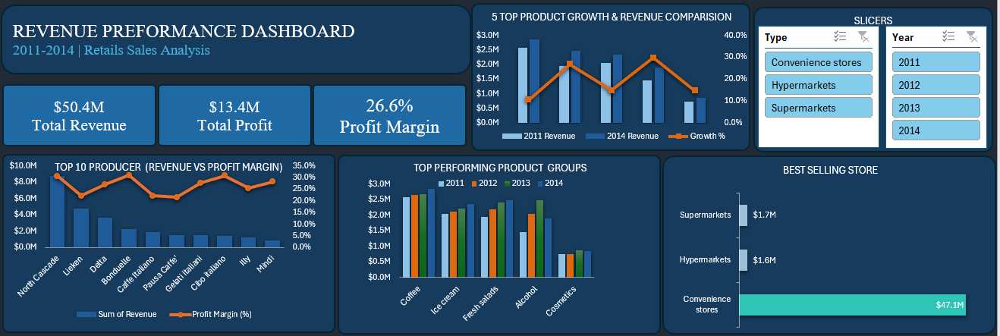

📊 Revenue Performance Analysis | Excel Dashboard + SQL
🚀 Project Summary

This project demonstrates a complete end-to-end data analysis workflow using Microsoft Excel and SQL to evaluate revenue, profitability, product performance, and store-level trends from 2011–2014.

The goal was to transform raw sales data into actionable business insights through structured data cleaning, pivot analysis, dashboard visualization, and strategic recommendations.

🎯 Business Objective

To identify:

Top-performing product groups

Best-selling outlets

Highest revenue-generating producers

Profitability trends over time

Data-driven recommendations for growth

All reporting and visualization were built using a Microsoft Excel Dashboard.

🧹 Data Preparation & Cleaning

Identified and handled missing data (Volume & Revenue alignment).

Used median imputation (816) due to right-skewed distribution.

Recalculated Revenue using:
Revenue = Price per Unit × Volume

Removed non-analytical code/ID columns.

Validated consistency across Revenue, Profit, and Margin fields.

✔ Demonstrates statistical reasoning and data validation practices.

🛢 SQL Integration

A simple relational database structure was designed to:

Aggregate revenue by product and year

Rank top producers

Calculate profit margins

Group performance by store type

✔ Demonstrates ability to structure analytical datasets for database environments.

📊 Key Insights

Coffee consistently generated the highest revenue across all years.

North Cascade was the strongest revenue growth driver.

Convenience stores recorded the highest overall profitability.

Average profit margin remained stable at ~26.58%.

2014 marked the peak revenue performance year.

📌 Strategic Recommendations

Increase investment in high-performing categories (e.g., Coffee).

Expand distribution partnerships with convenience stores.

Reassess low-margin product pricing strategies.

Implement customer feedback systems to improve product positioning.

🛠 Technical Skills Demonstrated

Microsoft Excel (Advanced Pivot Tables & Dashboard Design)

KPI Development

Data Cleaning & Transformation

SQL Database Structuring

Profitability Analysis

Business Intelligence Reporting

📂 Repository Contents

Revenue_Performance_Analysis.xlsx
(Raw Data + Cleaned Data + Pivot Analysis + Dashboard + SQL Sheet)

## 📊 Dashboard Preview

